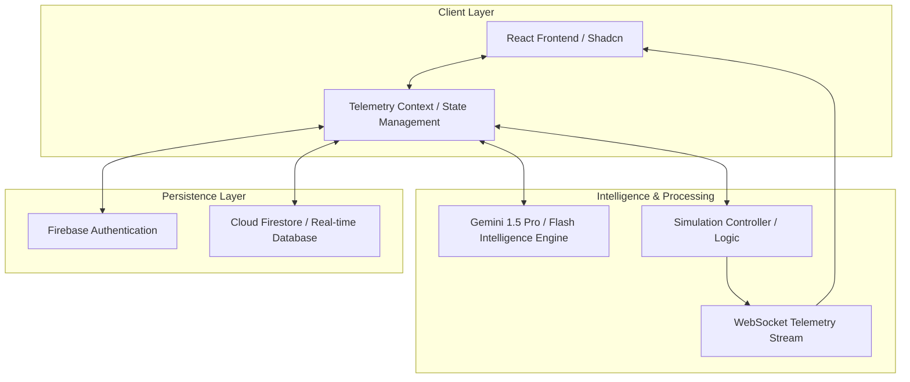

# Trace: macOS Telemetry Intelligence Platform

## Description
Trace is an advanced macOS telemetry intelligence and adversary behavior analysis platform. It enables security researchers, detection engineers, and blue teams to model complex macOS system behaviors, analyze malicious tradecraft (like Atomic Stealer or LockBit), and identify critical telemetry gaps in existing security stacks. By simulating real-world adversary actions against defensive heuristics, Trace provides a data-driven path to hardening macOS fleet visibility.

---

## Key Features
- **Adversary Behavior Simulation**: Execute high-fidelity macOS attack scenarios targeting ESF (Endpoint Security Framework) and Unified Log telemetry.
- **AI-Powered Threat Intelligence**: Integrates with Gemini AI to ingest the latest macOS threat research and automatically align simulation profiles with emerging malware.
- **Visibility Matrix & Gap Analysis**: Interactive heatmaps mapping detection coverage against the MITRE ATT&CK framework for macOS.
- **Real-time Telemetry Stream**: Live WebSocket integration simulating ES_EVENT_TYPE_NOTIFY_EXEC and other core system events.
- **Adversary vs. Defender Labs**: Watch real-time "cat and mouse" simulations where the AI attacker adapts to defensive memory scanning and TCC bypass detections.
- **Intelligence Dashboard**: Consolidated view of active macOS campaigns, research papers, and alignment status.

---

## System Architecture



<p align="center"><b>Figure 1: Trace Platform System Architecture</b></p>

### Architecture Flow Explanation:
1.  **Client Interactions**: The user interacts with the **React Frontend**, which captures intent and passes it to the **Telemetry Context**. This context acts as the central brain, broadcasting state changes to all UI components.
2.  **Intelligence Synthesis**: When the user requests a threat analysis or visibility explanation, the context calls the **Gemini Intelligence Engine**. This engine analyzes current telemetry gaps and simulation history to provide expert-level insights.
3.  **Simulation Execution**: When a scenario is launched, the **Simulation Controller** orchestrates a sequence of "Attacker" and "Defender" actions. These actions are emitted as raw JSON events through a **WebSocket Stream**, simulating a real macOS kernel-level telemetry source.
4.  **Real-time Feedback**: The UI listens to the WebSocket stream, updating the **Telemetry Explorer** and **Behavior Graph** in real-time, creating a feel of live system monitoring.
5.  **State Persistence**: All simulation history, custom scenarios, and notifications are synchronized with **Firebase Firestore**. This ensures that results are saved across sessions and collaborative history is maintained.

---

## Tech Stack
- **Framework**: React 18 + Vite
- **Styling**: Tailwind CSS + Shadcn UI
- **AI Engine**: Google GenAI (Gemini SDK)
- **Backend / Persistence**: Firebase (Firestore, Auth)
- **State Management**: React Context API
- **Visualization**: Recharts, Lucide React, Framer Motion
- **Communication**: WebSockets (Real-time telemetry)

---

## Detailed Setup Steps (The "Baby Steps" Guide)

Follow these exact steps to launch Trace from scratch. No prior experience is required.

### 1. Install Node.js
Trace requires a modern Node.js environment.
- Go to [nodejs.org](https://nodejs.org/).
- Download and install the **LTS (Long Term Support)** version.
- Open your terminal (Command Prompt, PowerShell, or Terminal on macOS).
- Type `node -v` and press Enter. You should see a version number (e.g., `v20.x.x`).

### 2. Prepare the Project Directory
- Navigate to the folder where you want the app to live.
- Make sure you have all the source files in this folder.

### 3. Install Dependencies
This step downloads all the "building blocks" (libraries) Trace needs.
- In your terminal, make sure you are in the project folder.
- Type the following command and press Enter:
  ```bash
  npm install
  ```
- Wait for the progress bar to finish. You may see some "vulnerabilities" warnings; these are typical for development environments—you can ignore them for now.

### 4. Configure Your Environment Keys
Trace needs an AI key to think and a Firebase config to save data.
- Look for a file named `.env.example` in the root folder.
- Rename it to `.env` (or create a new file named `.env`).
- Open `.env` in any text editor (Notepad, VS Code, etc.).
- Add your **Gemini API Key**:
  ```env
  GEMINI_API_KEY=your_actual_key_here
  ```
- Add your **Firebase Configuration** (you can get this from the Firebase Console):
  ```env
  VITE_FIREBASE_API_KEY=...
  VITE_FIREBASE_AUTH_DOMAIN=...
  VITE_FIREBASE_PROJECT_ID=...
  ```

### 5. Launch the Development Server
This starts the local web server so you can see the app.
- In your terminal, type the following and press Enter:
  ```bash
  npm run dev
  ```
- The terminal will display a URL, usually `http://localhost:3000`.
- Open your web browser (Chrome or Safari recommended) and go to that URL.

### 6. Verify the Launch
- You should see the Trace Landing Page.
- Click **"Get Started"** to enter the Intelligence Engine.
- If you see a loading spinner saying "Initializing Intelligence Engine," give it a moment to talk to Gemini AI for the first time.
