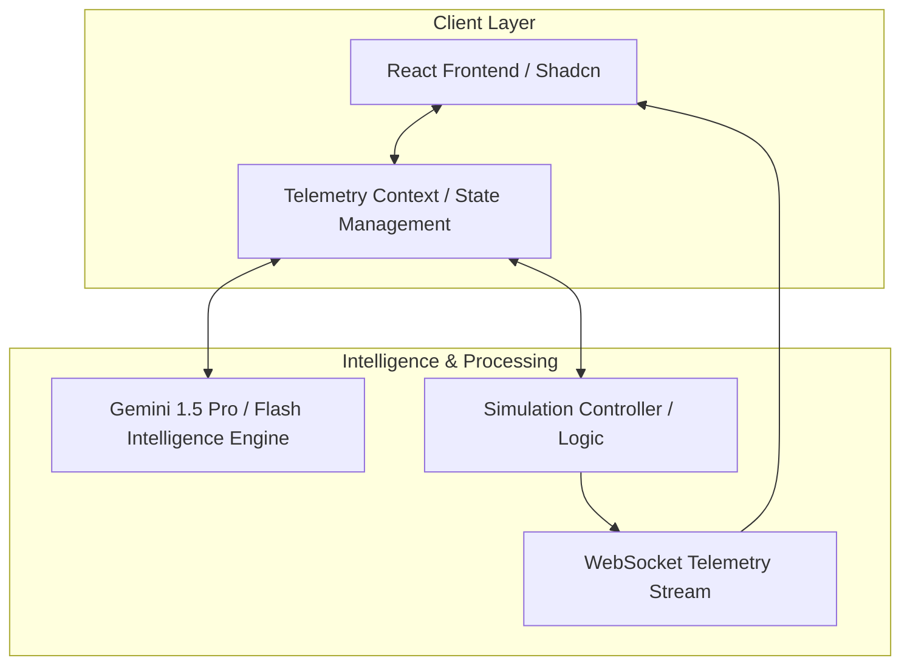

# Trace: macOS Telemetry Intelligence Platform

## Description
Trace is an advanced macOS telemetry intelligence and adversary behavior analysis platform. It enables security researchers, detection engineers, and blue teams to model complex macOS system behaviors, analyze malicious tradecraft (like Atomic Stealer or LockBit), and identify critical telemetry gaps in existing security stacks. By simulating real-world adversary actions against defensive heuristics, Trace provides a data-driven path to hardening macOS fleet visibility.

---

## Key Features
- **Adversary Behavior Simulation**: Execute high-fidelity macOS attack scenarios targeting ESF (Endpoint Security Framework) and Unified Log telemetry.
- **AI-Powered Threat Intelligence**: Integrates with Gemini AI to ingest the latest macOS threat research and automatically align simulation profiles with emerging malware.
- **Visibility Matrix & Gap Analysis**: Interactive heatmaps mapping detection coverage against the MITRE ATT&CK framework for macOS.
- **Real-time Telemetry Stream**: Live WebSocket integration simulating ES_EVENT_TYPE_NOTIFY_EXEC and other core system events.
- **Adversary vs. Defender Labs**: Watch real-time "cat and mouse" simulations where the AI attacker adapts to defensive memory scanning and TCC bypass detections.
- **Intelligence Dashboard**: Consolidated view of active macOS campaigns, research papers, and alignment status.

---

## System Architecture



<p align="center"><b>Figure 1: Trace Platform System Architecture</b></p>

### Architecture Flow Explanation:
1.  **Client Interactions**: The user interacts with the **React Frontend**, which captures intent and passes it to the **Telemetry Context**. This context acts as the central brain, broadcasting state changes to all UI components.
2.  **Intelligence Synthesis**: When the user requests a threat analysis or visibility explanation, the context calls the **Gemini Intelligence Engine**. This engine analyzes current telemetry gaps and simulation history to provide expert-level insights.
3.  **Simulation Execution**: When a scenario is launched, the **Simulation Controller** orchestrates a sequence of "Attacker" and "Defender" actions. These actions are emitted as raw JSON events through a **WebSocket Stream**, simulating a real macOS kernel-level telemetry source.
4.  **Real-time Feedback**: The UI listens to the WebSocket stream, updating the **Telemetry Explorer** and **Behavior Graph** in real-time, creating a feel of live system monitoring.
5.  **Local Persistence**: All simulation history, custom scenarios, and notifications are saved to your browser's local storage. This ensures that results are saved across sessions.

---

## Tech Stack
- **Framework**: React 18 + Vite
- **Styling**: Tailwind CSS + Shadcn UI
- **AI Engine**: Google GenAI (Gemini SDK)
- **State Management**: React Context API
- **Visualization**: Recharts, Lucide React, Framer Motion
- **Communication**: WebSockets (Real-time telemetry)

---

## Detailed Setup Steps (The "Baby Steps" Guide)

Follow these exact steps to launch Trace from scratch. No prior experience is required.

### 1. Install Node.js
Trace requires a modern Node.js environment.
- Go to [nodejs.org](https://nodejs.org/).
- Download and install the **LTS (Long Term Support)** version.
- Verify the installation: Open your terminal and run:
  ```bash
  node -v
  npm -v
  ```

### 2. Clone and Prepare the Repository
Open your terminal and run these commands in order:
```bash
# Clone the repository (if you have the URL)
git clone https://github.com/your-username/trace.git

# Enter the project directory
cd trace
```

### 3. Install Dependencies
This step downloads all the libraries Trace needs to run.
```bash
npm install
```

### 4. Configure Your Gemini AI Key
Trace needs an AI key to generate simulations and analysis.
```bash
# Create a configuration file from the example
cp .env.example .env
```
Now, open the newly created `.env` file in a text editor (Notepad, TextEdit, VS Code) and paste your Gemini API Key:
```env
GEMINI_API_KEY=your_actual_key_here
```

### 5. Launch the Platform
Start the local development server:
```bash
npm run dev
```
Trace will now be running at:
**[http://localhost:3000](http://localhost:3000)**

### 6. Verify the Launch
- Open up `http://localhost:3000` in Chrome or Safari.
- You should see the Trace Landing Page.
- Click **"Launch Console"** to enter the Intelligence Engine.
- Give it a moment to initialize the Intelligence Engine for the first time.

---
© 2026 Trace Security Research. All rights reserved.
