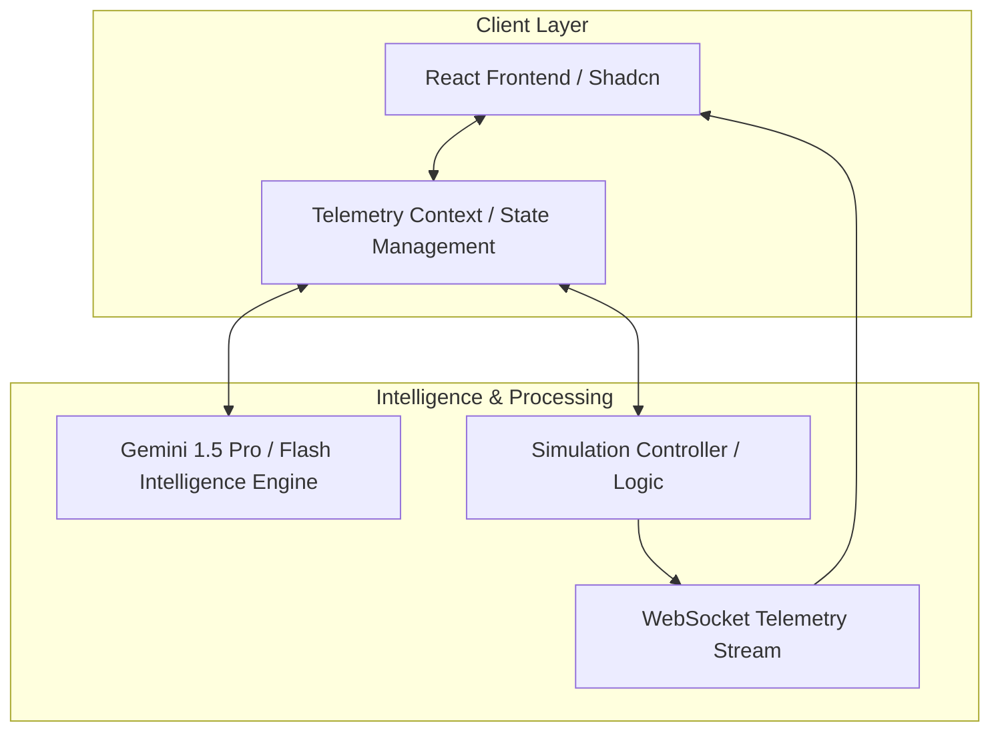

# Trace Platform Technical Documentation

## Executive Summary
Trace is an advanced macOS telemetry intelligence and adversary behavior analysis platform. It empowers security researchers, detection engineers, and blue teams to model complex macOS system behaviors, analyze malicious tradecraft (such as Atomic Stealer or LockBit), and identify critical telemetry gaps within their existing security stacks. By simulating real-world adversary actions against defensive heuristics, Trace offers a data-driven approach to hardening macOS fleet visibility. It leverages real-time telemetry streaming, dynamic MITRE ATT&CK mapping, and an AI-powered intelligence engine to provide comprehensive security insights.

## System Architecture

<b>Figure 1: Trace Platform System Architecture</b>

### Architecture Flow Explanation

1. **Client Interactions:** The user interacts with the **React Frontend** (built with React 18, Vite, Tailwind CSS, and Shadcn UI). User actions and intents are captured and passed to the **Telemetry Context**, which acts as the central state management hub, broadcasting state changes across all UI components.
2. **Intelligence Synthesis:** When a user requests threat analysis, visibility explanation, or scenario generation, the context interfaces with the **Gemini Intelligence Engine** (using the Google GenAI SDK). This engine analyzes telemetry gaps, simulation history, and emerging threat data to provide expert-level, context-aware insights and actionable hardening recommendations.
3. **Simulation Execution:** Upon launching an attack scenario, the **Simulation Controller** orchestrates a sequence of simulated "Attacker" and "Defender" actions. These actions generate raw JSON events emitted through a **WebSocket Stream**, mimicking a real macOS kernel-level telemetry source (like ESF or Unified Log).
4. **Real-time Feedback:** The UI components listen to the WebSocket stream, dynamically updating the **Telemetry Explorer**, **Dashboard**, and **Behavior Graph** in real-time. This provides immediate, interactive feedback on the simulated system's state.

## Features & Components

### Dashboard
The Dashboard serves as the central command center, offering a high-level, real-time overview of the system's security posture.
* **Security Posture Score:** A dynamically calculated percentage reflecting the ratio of secure to vulnerable attack surface items. It drops when simulations successfully execute attacks and introduce vulnerabilities.
* **Visibility Matrix (Radar Chart):** Provides a visual assessment of detection coverage across the MITRE ATT&CK framework tactics (Execution, Persistence, Defense Evasion, Credential Access, Discovery). The score is positively influenced by ingested signals and negatively impacted by identified telemetry gaps.
* **Metrics Cards:** Displays key metrics including total Active Scenarios and real-time Surface Risks.
* **MITRE ATT&CK Coverage (Bar Chart):** Maps detected techniques to their corresponding MITRE tactics, visualizing the breadth of kill-chain coverage.
* **Top Processes (Pie Chart):** Identifies the most active processes by event volume, aiding in anomaly detection.
* **Security Intelligence Insights:** Displays a feed of recent, high-severity anomalies and research alignment insights generated by the AI engine.
* **AI Expert Chat:** Integrates a chatbot to interact with the Gemini engine specifically regarding the current Visibility Matrix scores.

### Telemetry Explorer
The Telemetry Explorer provides a deep dive into the raw events generated by the system and simulations.
* **Data Grid:** A tabular view of all normalized events, including Timestamp, Event Type, Category, Process Name, MITRE mapping, Command Line, and User.
* **Filtering and Sorting:** Allows users to filter events by source (ESF, Unified Log, osquery, Simulator) and search across processes, commands, or users. Columns are sortable.
* **Event Details Modal:** Clicking a row opens a comprehensive view of the event, displaying full metadata, highlighted file paths, and detailed MITRE ATT&CK alignment.
* **Export Capability:** Telemetry data can be exported to a CSV file for external analysis.

### Attack Scenarios
This component is the core simulation engine for testing defensive capabilities.
* **Scenario Execution:** Users can run predefined templates (e.g., "Browser to Persistence", "Dylib Hijacking", "Malicious LaunchAgent Persistence").
* **AI Scenario Generator:** Allows users to describe an attack pattern in natural language. The Gemini engine then generates a complete, structured simulation workflow with expected signals and MITRE mappings.
* **Workflow Visualization:** Displays the sequence of steps in a scenario, highlighting the current step during execution and detailing the expected telemetry signals.
* **Live Attack Log:** A real-time, terminal-like feed showing the step-by-step execution, outputs, and AI analysis of the simulated "Attacker vs. Defender" interaction.
* **Multi-Take Strategy (Adversary vs. Defender):** Running a scenario multiple times triggers an evolved attack strategy. For example, a second run might use base64 obfuscation to attempt to bypass the defenses that blocked the first run.
* **Simulation Settings:** Users can configure the speed (duration) and intensity of the simulation runs.

### Attack Surface Map
This feature maintains an inventory of system configurations and tracks vulnerabilities.
* **System Inventory:** Monitors system extensions, launch items (LaunchAgents/Daemons), TCC (Transparency, Consent, and Control) permissions, and SIP configuration.
* **Live Posture Calculation:** Visually represents the overall security posture and details the impact of identified risks versus verified secure components.
* **Dynamic Risk Injection:** When a simulation (like setting up persistence) succeeds, it automatically injects a "vulnerable" item into the attack surface inventory.
* **Historical Comparison (Multi-Take Analysis):** A comparative table showing how the attack surface and adversary strategies evolve across multiple runs of the same scenario.
* **Hardening Recommendations:** Provides specific, actionable advice (generated by AI) to remediate identified vulnerabilities.
* **Surface Item Details & Intelligence Chat:** Selecting an item displays its technical metadata (Identifier, Architecture, Code Signature status) and provides a dedicated chat interface to query the AI expert about that specific component.

### Gap Analysis
Focuses on identifying and analyzing detection blind spots.
* **Gap Identification:** Lists steps in simulations that failed to generate the expected telemetry signals.
* **Root Cause & Impact:** Details why the signal was missed (e.g., ESF limitation, Unified Log noise) and the security impact of the gap.
* **AI-Assisted Reasoning:** Users can request the Gemini engine to analyze the gap, providing a detailed explanation of the risk and suggesting alternative detection strategies.

### Behavior Graph
A visual, causal model of system interactions powered by D3.js.
* **Interactive Visualization:** Displays nodes (Processes, Files, Users, Network Sockets, Dylibs) and links representing their interactions (spawned, executed, wrote_to, loaded, connected).
* **Entity Intelligence:** Clicking a node reveals its metadata, including MITRE mappings, command lines, and execution context.
* **Highlighting & Filtering:** Selecting a node highlights its direct connections. Users can filter the graph by entity type.
* **Threat Hunting Insights:** Provides contextual tips on what anomalous patterns to look for within the graph (e.g., unexpected parent-child relationships).

### Security Intelligence
A centralized feed for threat intelligence and research alignment.
* **Dynamic Research Alignment:** Maps the platform's current state and simulation data to real-world macOS security research trends.
* **Threat Feed:** Periodically fetches (every 15 minutes) and displays the latest macOS threats, malware campaigns, and vulnerabilities.
* **Source Investigation:** Links directly to official research papers or performs targeted searches for detailed threat analysis.
* **System Intelligence Overview:** Summarizes the active intelligence modules and alignment status.

### History
An archive of all executed simulations.
* **Simulation Archiving:** Stores the complete telemetry stream, attack logs, and AI analysis for every run.
* **State Restoration:** The "Reopen Simulation" feature restores the application state to that specific historical run, allowing users to re-examine the behavior graph, telemetry, and attack surface context for that session.

### Search & Navigation
* **Global Search:** Accessible via `Cmd+K`, allowing users to quickly navigate across different platform views.
* **Contextual Tooltips:** Extensive "How this section works" tooltips throughout the UI provide immediate explanations of features and intelligence metrics.

## Conclusion
Trace provides a highly interactive and intelligent environment for macOS security analysis. By combining active adversary emulation with real-time telemetry processing and dynamic AI-driven insights, it enables security teams to move beyond static analysis. The platform's ability to model attacks, highlight visibility gaps, and dynamically recommend hardening strategies makes it an invaluable tool for understanding and defending against sophisticated macOS-specific tradecraft.
